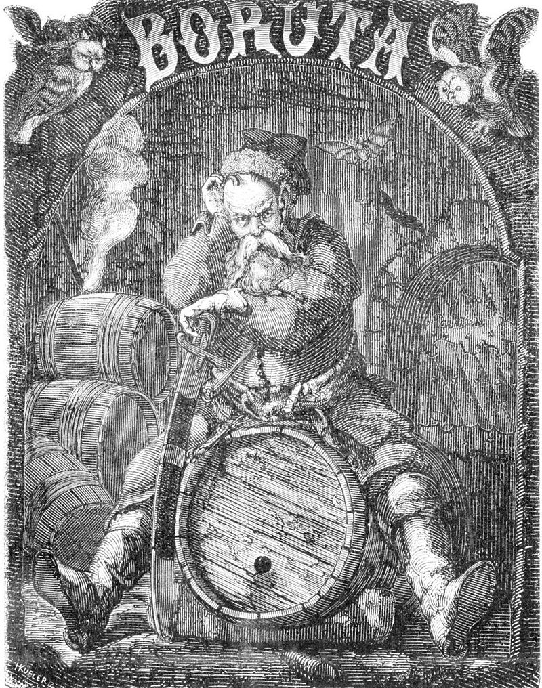

```{r setup, include=FALSE}
options(htmltools.dir.version = FALSE)
knitr::opts_chunk$set(
  fig.width=9, fig.height=3.5, fig.retina=3,
  out.width = "100%",
  cache = FALSE,
  echo = FALSE,
  message = FALSE, 
  warning = FALSE,
  hiline = TRUE
)


library(RefManageR)
BibOptions(check.entries = FALSE, bib.style = "authoryear", style = "markdown",
           dashed = TRUE)

BibOptions(hyperlink=FALSE);

bib <- ReadBib("references.bib")
```

```{r xaringan-themer, include=FALSE, warning=FALSE}
library(xaringanthemer)


primary_color <- "#FFFFFF" #"#024959"
secondary_color <- "#024959"#"#F2D605"
xaringanthemer::style_duo(
  primary_color = primary_color,
  secondary_color = secondary_color,
  header_font_google = google_font("Didact Gothic", "400", "400i"),
  text_font_google   = google_font("IBM Plex Sans", "400", "400i"),
  text_font_size = "1.5rem",
  )

style_extra_css(css = list(".todo" = list(color = "#17C25B"),
                           ".optional" = list(color = "#05BCE6"),
                           ".large" = list(`font-size` = "130%"),
                           ".small" = list(`font-size` = "80%"),
                           ".tiny" = list(`font-size` = "50%"),
                           ".full" = list(padding = "0px",
                                          margin = "0px",
                                          border = "0px"),
                           ".vertical" = list(`writing-mode` = "vertical-rl",
                                              `text-orientation` = "mixed")),
                )


library(semtree)
library(ggplot2)
library(tidyverse)
library(svglite)
library(qrcode)

```
class: center middle

# Question: “Given a multivariate model, which predictors/covariates are relevant?

---

class: inverse center middle

# SEM + Decision Trees + Random Forests + Variable Importance + BORUTA


Roadmap
---


# SEM

```{r}
knitr::include_graphics("img/SEM-measurement-structure.png")
```
---
class: center
# Commercial Break: Ωnyx


https://onyx-sem.com/
---
# Theory-driven modeling


---
# Decision Trees

<center>


`r Citet(bib, "gigerenzer2005fast")`

---
 
# Data-driven modeling


---
class: inverse, center, middle
# SEM Trees

---

# A Simple Example: Wechsler Intelligence Scale for Children

.pull-left[

]

.pull-right[

]

<small>`r Citet(bib, "brandmaier2013structural")`</small>

---
# A Simple Example: WISC


<center>


<small>N=204 children, McArdle & Epstein, 1987</small>

---

# A Simple Example: WISC


<center>


---

# A Simple Example: WISC

<center>


---

# A Simple Example: WISC

<center>

---

# Theory-guided exploration


<small>`r Citet(bib,"brandmaier2016theory")` </small>

---

# Variable Importance

.pull-left[
- single trees are unstable ->  subsample data and predictors to create a forest with diverse predictor combinations
- using a permutation approach, estimate contribution of each predictor `r Citep(bib,"brandmaier2016theory")`
- Example: Terminal decline of happiness from SOEP data
`r Citep(bib,"brandmaier2017terminal")`
]

.pull-right[


]


---
class: inverse, center, middle
# BORUTA

<center></center>

A spirit or devil from slavic mythology, <small>image from Wikipedia/Public Domain</small>

---
class: inverse middle center
# Shadow features

Create random copies of all predictors (_shadow features_)
 features; keep predictors outperforming shadow features `r  Citep(bib, "boruta")`

---

# Algorithm

- Create a copy of the original data set
- Create shadow features by permutation of all non-rejected features (remove association of shadow features with outcome(s) )
- Run a SEM forest and variable importance
- A feature is considered relevant if it performs better than the best shadow feature (**'hit'**)
- Run a statistical test for each original predictor (H0: predictor performs like max of shadow features)
- If significant, tag predictor as **'confirmed'** or **'rejected'**, otherwise leave as **'tentative'**
- repeat until no tentative features (or too may iterations)


---
# Us combining SEM forests and BORUTA

<center>


(according to ChatGPT)
---
class: inverse center middle

# A minimal proof of concept


---
# Setup

- Randomly draw ordinal $x1$ to $x6$ from ${0,1,2}$
- Generate a dataset of $N=1000$
- Compute outcome according to: 
$$y = 2\cdot x1+1\cdot x2+0.1\cdot x3+\mathcal{N}(0,0.01)$$
- Run BORUTA with 100 trees per forest for 11 runs
- Outcome model with only mean of $y$ (basically like CART)
---
# A simple SEM tree
```{r}
tree_ex1 <- readRDS("results/sim2/tree.rds")
plot(semtree::prune(tree_ex1,2))
```

---
# Variable importance
```{r}
boruta_results <- readRDS("results/sim2/boruta_result.rds")
barplot(simplify2array(boruta_results$impHistory[1,1:6]))
```
---

# BORUTA results

```{r}
boruta_results <- readRDS("results/sim2/boruta_result.rds")
plot(boruta_results)
```
---
class: center middle inverse

# Example: Depression Anxiety Stress Scales (DASS)

---

# Example: DASS

- open data from openpsychometrics.org
- data was collected with an online version of the Depression Anxiety Stress Scales (DASS) (http://www2.psy.unsw.edu.au/dass/)
- 2df outcome model with mean and variance of the DASS sum score (42 items)
- predictors: age, education, gender, handedness, urban, family size, screen size, voted
- $N=38,385$ complete cases (after some data cleaning)

---
# SEM Tree with DASS

```{r}
tree <- readRDS("results/ex3/tree.rds")
plot(tree)
```
---
# SEM Tree with DASS (zoom in)

```{r out.height="80%", out.width="80%"}
tree <- readRDS("results/ex3/tree.rds")
plot(semtree::prune(tree,2))
```
---

# Example: DASS
```{r}
boruta_results<-readRDS("results/ex3/boruta_results_run2.rds")
plot(boruta_results)
```

---


# Max-Operator

`max()`-operator on the shadow importance is problematic:

- the more shadow features, the larger the expected value of the maximum over all shadow features

- the threshold of relevance changes depending on the number of initial features

- as features get rejected, the threshold tends gets lower

Possible fix: quantile instead of max?

---

# Why you should not use it

- BORUTA is a naive wrapper algorithm and computationally quite costly 
--

- As always: type-I and type-II errors depend on sample size, effect size, multiple testing adjustments
--

- Difficult implications of "confirmation" and "rejection"
--

- Categorization hardly really helpful for theory advancement
--

- No short cut to a new theory

---
# Thank You

Slides: https://github.com/brandmaier/boruta_presentation_dgps

.pull-left[
Contact: andreas.brandmaier@medicalschool-berlin.de or @brandmaier on X or .strong[@brandmaier.bsky.social] on Bluesky or .strong[https://www.brandmaier.de]

]

.pull-right[

```{r, echo=FALSE}
link <- "https://github.com/brandmaier/boruta_presentation_dgps"
```

```{r, echo=FALSE, out.width = "30%", out.extra='style="float:center"'}
#if (!file.exists("img/qr_slides.svg")) {
generate_svg(qr_code(link), here::here("img/", "qr_slides.svg"), foreground = secondary_color, background = primary_color, show = FALSE)
#}
knitr::include_graphics("img/qr_slides.svg")
```
]
---
# References

.small[
```{r, results='asis', echo=FALSE}
PrintBibliography(bib)
```
]