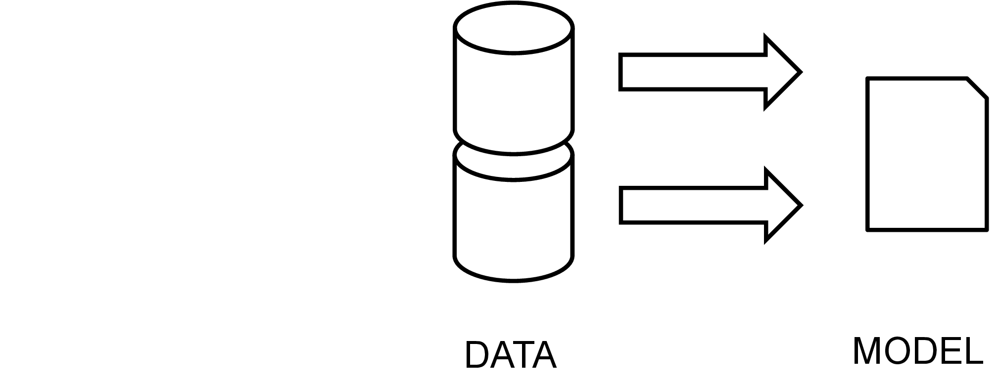
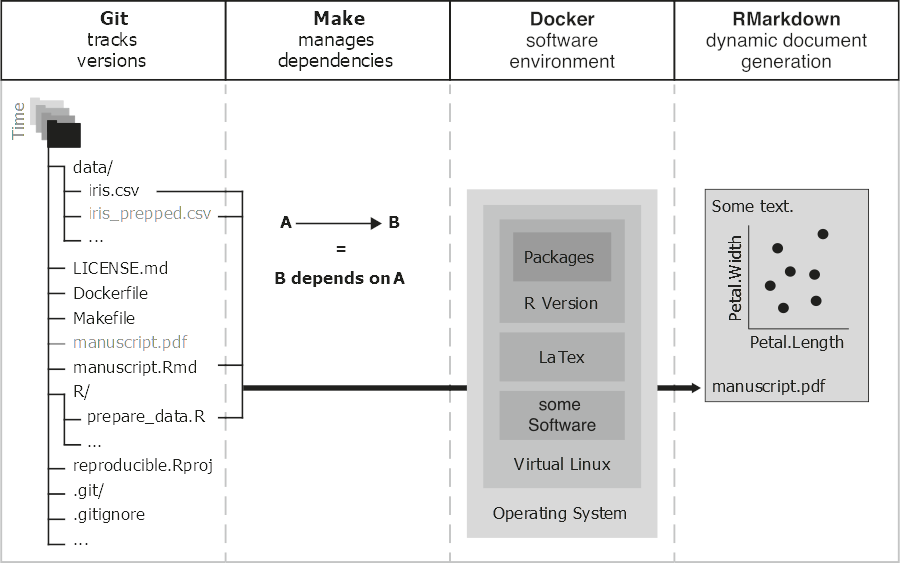

```{r setup, include=FALSE}
options(htmltools.dir.version = FALSE)
knitr::opts_chunk$set(
  fig.width=9, fig.height=3.5, fig.retina=3,
  out.width = "100%",
  cache = FALSE,
  echo = FALSE,
  message = FALSE, 
  warning = FALSE,
  hiline = TRUE
)


library(RefManageR)
BibOptions(check.entries = FALSE, bib.style = "authoryear", style = "markdown",
           dashed = TRUE)

BibOptions(hyperlink=FALSE);

bib <- ReadBib("references.bib")
```

```{r xaringan-themer, include=FALSE, warning=FALSE}
library(xaringanthemer)


primary_color <- "#FFFFFF" #"#024959"
secondary_color <- "#024959"#"#F2D605"
xaringanthemer::style_duo(
  primary_color = primary_color,
  secondary_color = secondary_color,
  header_font_google = google_font("Didact Gothic", "400", "400i"),
  text_font_google   = google_font("IBM Plex Sans", "400", "400i"),
  text_font_size = "1.5rem",
  )

style_extra_css(css = list(".todo" = list(color = "#17C25B"),
                           ".optional" = list(color = "#05BCE6"),
                           ".large" = list(`font-size` = "130%"),
                           ".small" = list(`font-size` = "80%"),
                           ".tiny" = list(`font-size` = "50%"),
                           ".full" = list(padding = "0px",
                                          margin = "0px",
                                          border = "0px"),
                           ".vertical" = list(`writing-mode` = "vertical-rl",
                                              `text-orientation` = "mixed")),
                )


library(semtree)
library(ggplot2)
library(tidyverse)
library(svglite)
library(qrcode)

```
class: center middle

# Question: “Given a (theory-based) multivariate model, which predictors/covariates are relevant?

---

class: inverse center middle

# SEM + Decision Trees + Random Forests + Variable Importance + Focus Parameters


Roadmap
---


# SEM = Structure + Measurement

```{r}
knitr::include_graphics("img/SEM-measurement-structure.png")
```
---
# SEM
More formally, let $\mathbf{x}$ be a $p$-dimensional vector of observed variables, which is a function of $m$ latent variables:

$$\mathbf{x} = \mathbf{\tau} + \mathbf{\Lambda\xi}+\mathbf{\epsilon} $$
- $\mathbf{\tau}$ are the $p$ intercepts
- $\mathbf{\Lambda}$ is the $p \times m$ factor loading matrix
- $\mathbf{\xi}$ are the $m$ latent factor scores
---
# SEM

With $\Phi$ being the covariance of the latent factors and $\Psi$ a covariance matrix of the residuals, we obtain a model-implied covariance matrix:

$$\mathbf{ \Sigma = \Lambda \Phi \Lambda^T + \Psi }$$
And (covariance) likelihood fit function (based on multivariate normal assumption):

<!--
$$-2LL = ln|\mathbf{\Sigma}|+tr\left(\mathbf{\Sigma^{-1} S} \right)-ln\left| \mathbf{S} \right| - \mathbf{p} $$
-->
$$-2LL = ln|\mathbf{\Sigma}|+tr\left(\mathbf{\Sigma^{-1} S} \right)-ln\left| \mathbf{S} \right| - \mathbf{p} $$
(for multiple independent groups, the log-likelihoods sum up)

---
class: center
# <s>Commercial</s> Break: Ωnyx


https://onyx-sem.com/ and [https://github.com/brandmaier/onyx](https://github.com/brandmaier/onyx)
---
# Theory-driven modeling


---
# Decision Trees

<center>


`r Citet(bib, "gigerenzer2005fast")`

---
 
# Data-driven modeling



---
class: inverse, center, middle
# SEM Trees

(an instance of model-based recursive partitioning `r Citep(bib, c("zeileis2008model"," brandmaier2013structural"))` )

---
# Theory-guided exploration


<small>`r Citet(bib,"brandmaier2016theory")` </small>

---

# A Simple Example: Wechsler Intelligence Scale for Children

.pull-left[

]

.pull-right[

]

<small>`r Citet(bib, "brandmaier2013structural")`</small>

---
# A Simple Example: WISC


<center>


<small>N=204 children, McArdle & Epstein, 1987</small>

---

# A Simple Example: WISC


<center>


---

# A Simple Example: WISC

<center>


---

# A Simple Example: WISC

<center>

---

# What do splits represent?

Splits in an LGCM may represent any combination of:
--

- Differences in mean within-person changes

--
- Differences in interindividual differences in within-person change
--

- Differences in the mean of the intercept
--

- Differences in interindividual differences in the intercept
--

- Differences in the correlation of intercept and within-person change
--

- Differences in reliability or growth curve misfit (differences in measurement error as part of the model residual variance)

---
class: inverse, center, middle
# Evaluating Splits in (SEM) Trees
---
# Testing for group differences

`r Citet(bib, c("brandmaier2013structural"))` proposed  old-school likelihood ratio test, given a parametric model $M$ with ML parameter estimates $\hat{\theta}$ and data $X$, which is exhaustively split into $X_1$ and $X_2$ with corresponding maximum likelihood estimates $\hat{\theta}_1$ and $\hat{\theta}_2$:
--

$$LR = -2LL \left( X_{1}|M(\hat{\theta}_1) \right)-2LL \left(X_{2}|M(\hat{\theta}_2) \right) + 2LL \left(X|\hat{\theta}) \right)$$
which is asymptotically $\chi^2$-distributed if $H_0$ is true (i.e., no group differences) with $df = dim(\theta)$
---


---
# Score-based Tests

.pull-left[
- Likelihood ratio tests are computationally expensive, we get convergence problems, naive LR test suffer from multiple testing issues and variable selection bias like CART  `r Citep(bib, c("strobl2007bias"))` 
- Let's use score tests (proposed for general model-based partitioning by `r Citet(bib, c("zeileis2008model"))` 
]

.pull-right[
<center>

]
---
# Score-based Tests

.pull-left[

]
.pull-right[
.small[
- Score based test statistics are functions of the case-wise derivatives of the (log)likelihood function
- Backbone of MOB in `party/partykit` and were also brought to SEM trees by `r Citep(bib,"arnold2021score")`
- Under H0 (no informative split), the cumulative score process is a Brownian bridge
- Various statistics available (e.g. maximum Lagrange multiplier $maxLM$; double maximum for illustration on the left)
]
]
---

# Focus parameters with LR tests

For $\chi^2$-based tests, instead of:

$$LR = -2LL \left( X_{1}|M(\hat{\theta}_1) \right)-2LL \left(X_{2}|M(\hat{\theta}_2) \right) + 2LL \left(X|\hat{\theta}) \right)$$
we estimate *loss of fit due to constraining only focus parameters* to identity across groups:

$$ LR = -2LL \left( X_1 \mid M(\hat{\theta}_1) \right) -2LL \left( X_2 \mid M(\hat{\theta}_2) \right) -2LL \left( X_1 \mid M(\hat{\theta}'_1) \right) -2LL \left( X_2 \mid M(\hat{\theta}'_2) \right) $$


<!-- 
\left( X_{2} \mid M(\hat{\theta}_2) \right) 
-2LL \left( X_{1} \mid M(\hat{\theta}'_1) \right) -2LL \left(X_{2}|M(\hat{\theta}'_2)) \right)
-->

with focus parameters constrained to be identical across groups for $\theta'_1$ and $\theta'_2$


---
# Focus parameters

This is more expensive because we need to obtain maximum likelihood estimates for every possible split:
$$argmax_{\theta'_1, \theta'_2}  -2LL \left( X_{1}|M(\theta'_1))-2LL(X_{2}|M(\theta'_2)) \right)$$

In total, we need two more iterative optimization processes per each potential split point (with potentially more convergence issues)
---

# Variable Importance

.pull-left[
- single trees are unstable
- subsample data and predictors to create a forest with diverse predictor combinations
- using a permutation approach, estimate contribution of each predictor to misfit `r Citep(bib,"brandmaier2016theory")`
- ...but beware of marginal importance; `r Citep(bib,"strobl2008conditional")`

]

.pull-right[
.small[
Example: Terminal decline of happiness from SOEP data
]
`r Citep(bib,"brandmaier2017terminal")`


]


---
class: center middle
# Some examples

---
# Univariate predictions

Let's simulate some Gaussian data and two dichotomous predictors `pred_mean` and `pred_var` that perfectly predict differences in either location or scale.  Also, we throw three uninformative predictors in the mix (binomial distributed):

<center>


Run a SEM forest based on a single indicator model with two parameters and compute variable importance

---
# (Marginal) Variable importance estimate
```{r}
vim_old<-readRDS("data/04_univsim_vim_semtree_f1old.rds")
plot(vim_old)
```
This is flawed because the influence of _pred\_var_ is overestimated.
---

# Problem

### Problem

Variable importance estimates overestimate the importance of predictors, which predict differences in parameters outside the focus


### Algorithm (for a given predictor $p$) to estimate _marginal importance_:

With SEM forest, we grow trees with no stopping rule ($\alpha=1$)
 in order to explore deep conditional effects (~interactions) in the trees

- For each tree, for every observation $x$ in the _OOB_, we compute the -2LL of observing $x$ given the leaf found before and after permuting predictor $p$
---
# Inspect first tree
(Pruned) Tree from a forest without focus parameters
```{r}
forest <- readRDS("data/04_sf.rds")

plot(semtree::prune(forest$forest[[2]],1))
```
---
# Inspect second tree
Another (pruned) Tree from a forest without focus parameters
```{r}
plot(prune(forest$forest[[4]],2))
```
---
# Problem

Problem: This measure of variable importance considers differences w.r.t all parameters of the SEM

Solution: Estimate misfit incurred by only the focus parameters

---
# Algorithm (estimate importance for focus parameters)

Let the parameter estimates of a SEM $M$ be $\hat{\theta}_M$ with a partition into focus-parameters $\hat{\theta}_M^f$ and other parameters $\hat{\theta}_M^{0}$  

Algorithm:

- For each tree, for each observation $x$, find leaf model $M_1$ by traversing the tree and leaf model by traversing the tree after permuting predictor $M_2$
- Get the estimates $\hat{\theta}_{M1}^f$ from $M_1$ and evaluate the likelihood of $x$ given $M_2$ using $\hat{\theta}^*= \left\{  \hat{\theta}_{M2}^0;  \hat{\theta}_{M1}^f \right\}$

---

# Back to the simulation

Simulated Data:


---
# Importance Estimates

Forest with (score-based) focus parameter on mean:

.pull-left[
```{r ll}
vim_new<-readRDS("data/04_univsim_vim_semtree_f1.rds")
vim_old<-readRDS("data/04_univsim_vim_semtree_f1old.rds")
plot(vim_old)
```
]

.pull-right[
```{r lr}
plot(vim_new)
```
]
---
# To Focus or not to focus

- Trees and forests yield identical results in `partykit` and `semtree` with focus parameter on mean 

```{r}
tree_party <- readRDS("data/04_univsim_vim_partykit.rds")
tree_semtree <- readRDS("data/04_univsim_semtree_f1.rds")
```
.pull-left[
```{r}
plot(tree_party)
```
]

.pull-right[
```{r}
plot(tree_semtree)
```
]

W/o focus: potentially interesting because differences in variances may also be of interest (e.g., meaningful individual differences or reliability differences)

---
class: inverse, center, middle
# Some more examples

---

# Journal Pricing

- The model to be partitioned is a linear regression for the number of library subscriptions by price per citation in log-log specification (i.e., with $k = 2$ coefficients) `r Citet(bib, c("zeileis2008model"))` 

- Predictors: the raw price and number of citations, the age of the journal, number of characters and a factor indicating whether the journal is associated with a society or not.

```{r echo=TRUE, eval=FALSE}
library(partykit)
j_tree <- partykit::lmtree(logsubs ~ lpc | price + citations +
                   + age + chars + society, data = Journals)
```
---
# Journal Pricing
```{r echo=FALSE, eval=TRUE}
data("Journals", package = "AER")
Journals <- transform(Journals,
                      age = 2000 - foundingyear,
                      chars = charpp * pages,
                      lpc = log(price/citations),
                      logsubs = log(subs))

library(partykit)

j_tree <- lmtree(logsubs ~ lpc | price + citations +
                   + age + chars + society, data = Journals, minsize = 10)

#j_tree <- lmtree(logsubs ~ lpc | citations, data = Journals, minsize = 10, verbose = TRUE)
plot(j_tree)
``` 

(Subscriptions per price-by-citation in log-scale)
---
# Regression SEM Tree


---

#
```{r}
tree<-readRDS("data/02_tree_foc.rds")
plot(tree)
```
Identical result: somewhat shallower slope for older journals
---
# Tree w/o focus parameter

.pull-left[
- If we run the tree without focus parameter, all parameters become potentially relevant
- Splits could be because of differences in intercept, differences in residual variance, or differences in predictor variance
]

.pull-right[
```{r}
tree<-readRDS("data/02_tree_unc.rds")
plot(tree)

param_leafs<-sapply(getLeafs(tree), function(x){ x$params})
colnames(param_leafs)<-paste0("Leaf #",1:ncol(param_leafs))
param_leafs <- round(param_leafs,2)
```
]
---
# Parameter Estimates of Trees

Here, we find differences w.r.t. all parameters (e.g., predictor mean and variance _MEAN\_lpc_ and _VAR\_lpc_) and also a large range of regression coefficients $b_1$ ranging from `r min(param_leafs["b1",])` to `r max(param_leafs["b1",])`.
```{r}
knitr::kable(param_leafs)
```
---

class: inverse, center, middle

# Measurement Invariance
---

# Measurement Invariance Testing

- "Lack of evidence of measurement invariance equivocates conclusions and casts doubt on theory in the behavioral sciences" `r Citep(bib, "horn1992practical")`
--

- Measurement Invariance is usually based on multigrop SEM/CFA `r Citep(bib, "marsh2014exploratory")`
--

- SEM Trees were suggested as a tool for measurement invariance testing, that is, to explore differential item functioning `r Citep(bib, c("finch2017structural","sterner2023exploratory"))`
--

- CFA partitioning can even be used without any groups at all `r Citep(bib, c("merkle2013tests"))`  
--

- As an example, `r Citet(bib, c("finch2017structural"))`  looked at a _attitudes towards reading items_ questionnaire


---
# Measurement Invariance

.pull-left[

]

.pull-right[
> SEMtree does not isolate specific differences among model parameters, but rather identifies differences in whole patterns of model parameters - `r Citep(bib, "finch2017structural")`
]

---
# BFI

As an example:

-  International Personality Item Pool `bfi` from `psych` package
- $n=2,800$
- 25 personality self report items (representing 5 OCEAN factors)
- Three demographic variables as predictors: age (metric), education (ordinal), sex (nominal)

---
# BFI

- Specify a CFA of five indicators for the construct _extraversion_: "don't talk a lot", "find it difficult to approach others", "Know how to captivate propl", "Make friends easily", "Take charge"
- anchor item: "don't talk a lot"
- choose only factor loadings and residuals as focus parameters (but not intercepts or latent mean/variance)
- Predictors: age, sex, and education
---
# BFI Tree
```{r}
tree<-readRDS("data/06_tree_focus.rds")
plot(prune(tree,3))
```
---
# BFI Loadings


.small[
(f3: Know how to captivate people and f5: Take charge)
]
---
# BFI Forest
Permutation variable importance with focus parameters loadings:

```{r}
vim <- readRDS("data/06_bfi_vim.rds")
plot(vim)
```
---

# Outlook I

- BORUTA (with Priyanka Paul & Timothy Brick, PennState)
- BORUTA is a heuristic to determine a cut-off between important and not-important variables 
- Based on shadow features 

---

# Outlook II

Ordinal models using threshold models (example: mammography screening experience and opinions from Citep(bib, "hothorn2006unbiased")`)

.pull-left[
```{r}
ptree<-readRDS("data/05_mammo_partytree.rds")
stree<-readRDS("data/05_mammo_tree.rds")
plot(ptree)
```

.small[
- SYMPT: You do not need a mamogram unless you develop symptoms (4 point Likert)
- PB: Perceived benefit (low value = strong benefit)
]
]

.pull-right[

]

# Summary

- SEM Trees and Forests are a form of model-based recursive partitioning
- They can be implemented either via the `semtree` package or via `partykit` (https://www.zeileis.org/news/lavaantree/)
- Focus parameters may be important when exploring the importance of predictors for subsets of parameters (e.g., individual differences vs means, or intercept vs slopes in growth models)

# Thank You

- Slides: https://github.com/brandmaier/focus-talk-dagstat2025

- Package on CRAN: `semtree`

.pull-left[
Contact: andreas.brandmaier@medicalschool-berlin.de or .strong[@brandmaier.bsky.social] on Bluesky or .strong[https://www.brandmaier.de]

]

.pull-right[

```{r, echo=FALSE}
link <- "https://github.com/brandmaier/focus-talk-dagstat2025"
```

```{r, echo=FALSE, out.width = "30%", out.extra='style="float:center"'}
#if (!file.exists("img/qr_slides.svg")) {
generate_svg(qr_code(link), here::here("img/", "qr_slides.svg"), foreground = secondary_color, background = primary_color, show = FALSE)
#}

```
]
---

class: inverse, center, middle
# Reproducibility + Exploratory Methods
---

# Why should we work reproducibly?

Many good reasons like: 

- Transparency
- Trustworthiness
- Replication
- Cumulative science

> Transparency and accessibility are central scientific values, and open, reproducible projects will increase the efficiency and veracity of knowledge accumulation `r Citep(bib, "bar2012reporting")`.

---

## Your closest collaborator is you six months ago, but you don’t reply to emails.

.footnote[From Karl Broman's lecture on reproducibility, paraphrasing Mark Holden]

---

## Forensics

If an analysis is repeated later in time and results do not align with what was published, it could be due to:

- changes in the core functions of dependent packages (e.g., bugfixes)
- changes in defaults of dependent packages (e.g., default test statistic for splits, default stopping criteria, default bucket size)
- changes in the data used (e.g., preprocessing, outlier removal)
- changes in the R script used (e.g., multiple versions were created during development and it's unclear, which one was used ultimately)

---

# Sources of Failure to Reproduce Results

.pull-right[  ]

1. **Multiple versions of scripts/data** (e.g., dataset has changed over, i.e., was further cleaned or extended)

--

2. **Multiple scripts** in a pipeline; unclear which scripts should be executed in which order

--

3. **Copy&paste errors** (e.g., inconsistency between reported result and reproduced result)

--

4. Broken **software dependencies** (e.g., analysis broken after update, missing package, just comes out differently on a different computer )


---

# Four Elements of Reproducibility

.center[

```{r, echo=FALSE, out.width='60%'}

```

]

.footnote[from Peikert and Brandmaier (2020)]
---
class: center, middle

# reproducibleRchunks


 

(now on CRAN: reproducibleRchunks)

---
# References

.small[
```{r, results='asis', echo=FALSE}
PrintBibliography(bib, start=1, end=6)
```
]

---
.small[
```{r, results='asis', echo=FALSE}
PrintBibliography(bib, start=7)
```
]